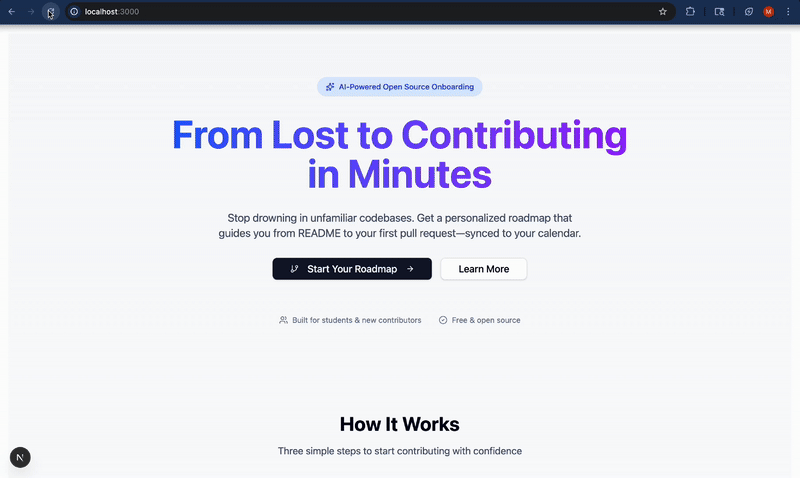

# 🗺️ Repo Roadmap - AI-Powered Open Source Onboarding

An intelligent agent that helps new contributors navigate unfamiliar open-source repositories by generating personalized onboarding roadmaps synced to Google Calendar.

## 🎯 Problem Statement

New open-source contributors and CS students struggle with:

- **Information overload**: Large codebases with unclear entry points
- **Generic guidance**: "Good first issue" labels aren't enough
- **Lack of personalization**: No context for skill level or learning style
- **No actionable plan**: Static recommendations don't translate into scheduled work

## ✨ Solution

Repo Roadmap provides:

1. **Personalized skill profiling** - Understand your background and preferences
2. **AI-powered analysis** - Analyze repos using vector search + LLM reasoning
3. **Custom roadmaps** - 3-5 step plans tailored to your skill level
4. **Calendar integration** - Sync steps to Google Calendar with time estimates

## 🎬 Demo



## 🛠️ Tech Stack

| Layer         | Technology                         | Why                                 |
| ------------- | ---------------------------------- | ----------------------------------- |
| Frontend      | Next.js 15 + React 19 + TypeScript | Modern full-stack framework         |
| UI Components | TailwindCSS + shadcn/ui            | Fast, clean, reusable components    |
| Auth          | NextAuth (GitHub OAuth)            | Secure GitHub login                 |
| Backend       | Next.js API Routes                 | Unified full-stack architecture     |
| Database      | TiDB Serverless                    | Vector search + SQL in one DB       |
| Vector Search | TiDB Vector Index                  | Hybrid retrieval for issue matching |
| LLM           | Google Gemini 2.0 Flash            | Cost-efficient reasoning            |
| Integrations  | GitHub API + Google Calendar       | Repo data + task scheduling         |
| Deploy        | Vercel                             | Easy Next.js deployment             |

<<<<<<< HEAD
=======
## 🏗️ Architecture & Data Flow

┌─────────────────────────────────────────────────────┐
│ USER BROWSER │
│ ┌────────────┐ ┌────────────┐ ┌──────────────┐ │
│ │ Landing │→ │ Onboard │→ │ Roadmap │ │
│ │ Page │ │ Form │ │ View │ │
│ └────────────┘ └────────────┘ └──────────────┘ │
└──────────────────────┬──────────────────────────────┘
│ HTTP/JSON
┌──────────────────────▼──────────────────────────────┐
│ NEXT.JS APP ROUTER │
│ ┌───────────────────────────────────────────────┐ │
│ │ API Routes (Serverless Functions) │ │
│ │ ┌────────┐ ┌──────────┐ ┌────────────────┐ │ │
│ │ │ /auth │ │ /profile │ │ /agent/roadmap │ │ │
│ │ └────────┘ └──────────┘ └────────────────┘ │ │
│ └───────────────────┬───────────────────────────┘ │
└──────────────────────┼──────────────────────────────┘
│
┌──────────────┼──────────────┐
│ │ │
┌───────▼────┐ ┌──────▼──────┐ ┌───▼─────────┐
│ TiDB │ │ GitHub │ │ Gemini │
│ Serverless │ │ API │ │ API │
│ │ │ │ │ │
│ ┌────────┐ │ │ ┌─────────┐ │ │ ┌─────────┐ │
│ │ users │ │ │ │ Repos │ │ │ │Embedding│ │
│ │profiles│ │ │ │ Issues │ │ │ │ Model │ │
│ │ issues │ │ │ │ Tree │ │ │ │ LLM │ │
│ │embeddin│ │ │ └─────────┘ │ │ └─────────┘ │
│ │roadmaps│ │ └─────────────┘ └─────────────┘
│ └────────┘ │
└────────────┘

>>>>>>> 0d9f672 (Add demo gif)
## ⚡ Features

### 1. Skill Profile Intake

- Skill level: Beginner / Intermediate / Advanced
- Track: Frontend / Backend / Full-stack
- Learning preference: Code / Docs / Tests
- Tech stack selection

### 2. Repository Ingestion

- Fetches README, issues, and repository tree from GitHub
- Stores content with vector embeddings (TiDB)
- Full-text search indexing on issues

### 3. Hybrid Issue Matching

- **Vector similarity**: Match issues to user profile embedding
- **Keyword scoring**: Boost based on labels and tech stack
- **Rule-based boosts**: Prefer "good first issue" for beginners
- Track affinity (frontend/backend label detection)

### 4. LLM-Powered Roadmap

- **Project structure summary**: Plain-English architecture explanation
- **Issue explanations**: Rewritten for skill level
- **3-5 step roadmap**: Setup → Exploration → First contribution
- Time estimates for each step

### 5. Calendar Sync

- Create calendar events for each roadmap step

## 🚀 Setup Instructions

### Prerequisites

- Node.js 18+ and npm
- TiDB Serverless account ([Sign up here](https://tidbcloud.com))
- GitHub OAuth App ([Create here](https://github.com/settings/developers))
- Google Gemini API key ([Get here](https://aistudio.google.com/apikey))

### 1. Clone the Repository

```bash
git clone <your-repo-url>
cd repo-roadmap
npm install
```

### 2. Set Up Environment Variables

Copy `.env.example` to `.env.local`:

```bash
cp .env.example .env.local
```

Fill in the values:

```env
# NextAuth
NEXTAUTH_URL=http://localhost:3000
NEXTAUTH_SECRET=<generate with: openssl rand -base64 32>

# GitHub OAuth
GITHUB_ID=<your_github_client_id>
GITHUB_SECRET=<your_github_client_secret>
GITHUB_TOKEN=<your_github_personal_access_token>

# TiDB Serverless
TIDB_HOST=<your_tidb_host>
TIDB_PORT=4000
TIDB_USER=<your_username>
TIDB_PASSWORD=<your_password>
TIDB_DATABASE=test

# Google Gemini API
GEMINI_API_KEY=<your_gemini_api_key>
GEMINI_MODEL=gemini-2.0-flash-001
```

### 3. Set Up TiDB Database

1. Create a TiDB Serverless cluster
2. Use the TiDB Cloud console to execute the SQL in [lib/db/schema-tidb-serverless.sql](lib/db/schema-tidb-serverless.sql)

Or run the automated setup script:

```bash
node scripts/create-tables.js
```

This will create all required tables including users, repos, issues, embeddings, and roadmaps.

### 4. Set Up GitHub OAuth

1. Go to [GitHub Developer Settings](https://github.com/settings/developers)
2. Create a new OAuth App
3. Set **Homepage URL** to `http://localhost:3000`
4. Set **Authorization callback URL** to `http://localhost:3000/api/auth/callback/github`
5. Copy the Client ID and Client Secret to your `.env.local`

### ▶️ 5. Run the Development Server

```bash
npm run dev
```

Visit [http://localhost:3000](http://localhost:3000)

## 📄 License

MIT

## 📄 Acknowledgments

Built with:

- [TiDB](https://tidbcloud.com) for vector search + SQL
- [Google Gemini](https://ai.google.dev) for embeddings and LLM
- [Next.js](https://nextjs.org) for full-stack framework
- [shadcn/ui](https://ui.shadcn.com) for UI components
